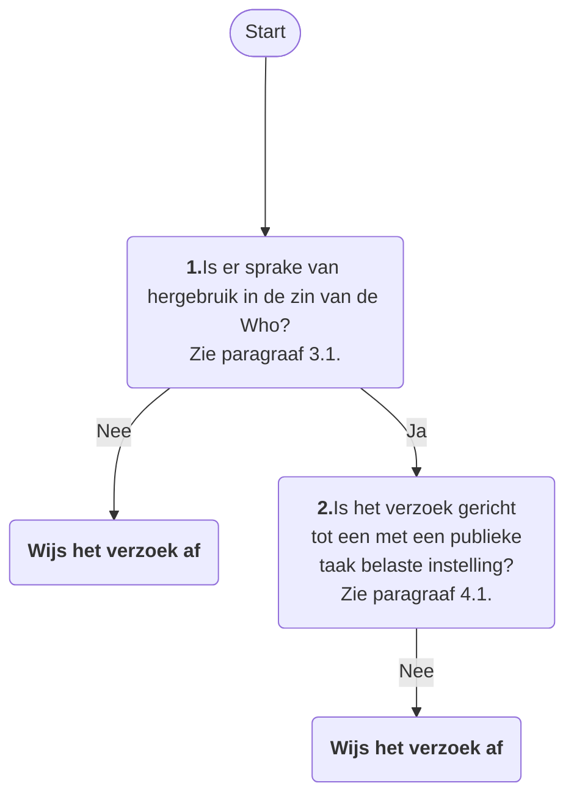

# Stappenplan
## Stappenplan <b>[UNDER CONSTRUCTION]</b>

<figure>
    

```mermaid


graph TD
    A([Start])---->B("<b>1.</b><br/>Is er sprake van hergebruik in de zin van de Who?<br/>Zie paragraaf 3.1.")
    B("<b>1.</b>Is er sprake van hergebruik in de zin van de Who?<br/>Zie paragraaf 3.1.")--Nee-->L("<b>Wijs het verzoek af</b>")
    B("<b>1.</b>Is er sprake van hergebruik in de zin van de Who?<br/>Zie paragraaf 3.1.")--Ja-->C("<b>2.</b>Is het verzoek gericht<br/> tot een met een publieke taak belaste instelling?<br/>Zie paragraaf 4.1.")
   C("<b>2.</b>Is het verzoek gericht<br/> tot een met een publieke taak belaste instelling?<br/>Zie paragraaf 4.1.")--Nee-->R("<b>Wijs het verzoek af</b>")


```

<figcaption>Het Stappenplan <UNDER CONSTRUCTION> </figcaption>
</figure>  
