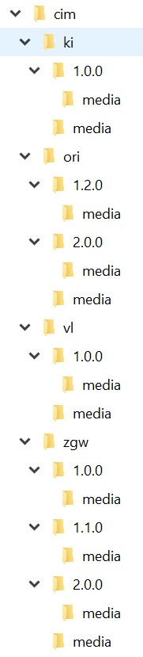

# Publiceren Respec documentatie (under construction)

Het is de bedoeling dat het publiceren van de statische html en pdf geautomatiseerd gaat verlopen. Dat hebben we helaas nog niet op orde en om die reden doen we dit voorlopig handmatig.

Het publiceren van Respec documentatie gebeurd niet vanuit de GitHub repository waarin deze wordt samengesteld en gegenereerd. 
In die repository kan nl. slechts één versie van die Respec documentatie met GitHub Pages worden aangeboden terwijl we de mogelijkheid willen hebben alle voorgaande versies ook aan te bieden. Anders zouden de links in het eerst deel van de Respec documenten ook dood lopen.
Om die reden wordt bij het genereren van Respec documentatie het bestanden 'snapshot.html' en een pdf bestand gegenereerd zodat we deze bestanden kunnen kopiëren naar de 'publicatie' repository vanwaaruit we alle Respec documentatie publiceren.

### Inrichten publicatie repository

> **LET OP!** 
> De hieronder uitgewerkte structuur van de publicatie GitHub repository is slechts een voorstel.

Voor het publiceren van alle Respec documenten in de GitHub repository 'publicatie' is de hieronder beschreven consistente structuur vereist. Deze consistente structuur moet overeenkomen met de waarde van in het globale configuratiebestand gedefinieerde properties 'latestVersion', 'thisVersion' en 'prevVersion'. Indien wordt besloten de inhoud van die properties aan te passen dan heeft dat ook gevolgen voor de repository structuur.

| folder- of bestandsnaam | Opmerking |
| --- | --- |
| cim | Het publicatie domein |
| &nbsp;&nbsp;&nbsp;&nbsp;[project-mnemonic] | De afkorting van het project. 'Open Raadsinformatie' wordt bijv. afgekort als 'ori'. |
| &nbsp;&nbsp;&nbsp;&nbsp;&nbsp;&nbsp;&nbsp;&nbsp;[x.x.x] | Het versienummer van het Respec document. Deze folder kan zich herhalen met steeds een ander versienummer. Komt minimaal 1x voor met als naam het huidige versienummer. |
| &nbsp;&nbsp;&nbsp;&nbsp;&nbsp;&nbsp;&nbsp;&nbsp;&nbsp;&nbsp;&nbsp;&nbsp;media | Folder waarin evt. illustraties staan opgenomen |
| &nbsp;&nbsp;&nbsp;&nbsp;&nbsp;&nbsp;&nbsp;&nbsp;&nbsp;&nbsp;&nbsp;&nbsp;index.html | Gegenereerde statische html (snapshot.html) welke overeenkomt met de versie, hernoemd. |
| &nbsp;&nbsp;&nbsp;&nbsp;&nbsp;&nbsp;&nbsp;&nbsp;&nbsp;&nbsp;&nbsp;&nbsp;cim-[project-mnemonic]-[x.x.x].pdf | Gegenereerd pdf bestand welke overeenkomt met de versie. |
| &nbsp;&nbsp;&nbsp;&nbsp;&nbsp;&nbsp;&nbsp;&nbsp;media | Folder waarin evt. illustraties staan opgenomen |
| &nbsp;&nbsp;&nbsp;&nbsp;&nbsp;&nbsp;&nbsp;&nbsp;index.html | Gegenereerde statische html (snapshot.html), welke overeenkomt met de huidige versie, hernoemd. |
| &nbsp;&nbsp;&nbsp;&nbsp;&nbsp;&nbsp;&nbsp;&nbsp;cim-[project-mnemonic]-[x.x.x].pdf | Gegenereerd pdf bestand welke overeenkomt met de huidige versie. |

In dit overzicht vertegenwoordigd `x.x.x` het versienummer van het Respec document. De folder met die naam kan zich herhalen maar komt minimaal 1x voor, de huiidge versie. De inhoud van die folder wordt dan eveneens geplaatst in de folder [project-mnemonic]. `project-mnemonic` is  Hieronder zie je een voorbeeld van deze structuur:

Tijdens het samenstellen van de inhoud van een nieuwe versie van een bestaand of geheel nieuw Respec document kun je de structuur in de 'publicatie' repository al aanpassen.
Betreft het de eerste versie van een Respec document creëer dan direct in de folder 'cim' een nieuwe folder die als naam de mnemonic van het project krijgt. Daarbinnen creëer je een versiefolder met als naam het versienummer waaronder je de eerste versie publiceert.
Bestaat de projectfolder al wel dan creëer in die folder een nieuwe versiefolder met als naam het versienummer waaronder je de nieuwe versie publiceert. In beide folders creëer je voorlopig een leeg 'index.html' bestand.

### Publiceren van documenten

Na generatie kunnen de bestanden 'snapshot.html' en 'snapshot.pdf' vanuit de GitHub repository waarin ze gegenereerd zijn worden gekopieerd projectfolder en naar de naar de zojuist aangemaakte versiefolder in de 'publicatie' repository. 
Het bestand 'index.html' verwijder je vervolgens in beide folders waarna je 'snapshot.html', eveneens in beide folder, hernoemt naar 'index.html'. Indien je in je Resoec documentatie images hebt geplaatst dan heb je die bestanden in de 'media' folder opgeslagen, kopieer in dat geval de 'media' folder eveneens naar beide folders.

Pas vervolgens in de root van de publicatie repository de 'index.md' aan zodat je toegang hebt tot alle Respec documentatie en de http links kunt kopiëren voor gebruik in andere GitHub Pages documentatie.
