# Het VNG-R Respec proces

Onderstaande flowchart beschrijft het proces zoals we dat binnen VNG Realisatie hanteren om tot Respec documentatie te komen. Daarnaast is het echter ook een voorbeeld van het gebruik van de Mermaid syntax voor het vervaardigen van zo'n flowchart. Zie de '[Flowchart syntax](https://mermaid.js.org/syntax/flowchart.html)' voor een uitleg van de Mermaid syntax.

```mermaid
%%{init: {"flowchart": {"defaultRenderer": "elk"}} }%%
graph TD;
    A("<b>1</b><br/>Genereer<br/>Respec html<br/>in Imvertor")--Generatie tak-->B{"<b>2</b><br/>Repo<br/>voor project<br/>aanwezig?"};
    B{"<b>2</b><br/>Repo<br/>voor project<br/>aanwezig?"}--Nee-->C("<b>3</b><br/>Creëer en<br/>configureer repo<br/>voor project");
    B{"<b>2</b><br/>Repo<br/>voor project<br/>aanwezig?"}--Ja-->D("<b>4</b><br/>Plaats<br/>Respec html in<br/>project");
    C("<b>3</b><br/>Creëer en<br/>configureer repo<br/>voor project")-->D("<b>4</b><br/>Plaats<br/>Respec html in<br/>project");
    D("<b>4</b><br/>Plaats<br/>Respec html in<br/>project")-->E{"<b>5</b><br/>Overige content<br/>voor Respec<br/>document<br/>aanwezig en<br/>up to date?"};
    E{"<b>5</b><br/>Overige content<br/>voor Respec<br/>document<br/>aanwezig en<br/>up to date?"}--Nee-->F("<b>6</b><br/>Creëer overige<br/>content en/of pas<br/>deze aan");
    E{"<b>5</b><br/>Overige content<br/>voor Respec<br/>document<br/>aanwezig en<br/>up to date?"}--Ja-->G("<b>7</b><br/>Pas document<br/>configuratie<br/>properties aan");
    F("<b>6</b><br/>Creëer overige<br/>content en/of pas<br/>deze aan")-->G("<b>7</b><br/>Pas document<br/>configuratie<br/>properties aan");
    A("<b>1</b><br/>Genereer<br/>Respec html<br/>in Imvertor")--Publicatie tak-->H{"<b>8</b><br/>Basisstructuur voor<br/>project aanwezig in<br/>'publicatie' repo?"};
    H{"<b>8</b><br/>Basisstructuur voor<br/>project aanwezig in<br/>'publicatie' repo?"}--Nee-->I("<b>9</b><br/>Creëer<br/>basisstructuur in<br/>'publicatie' repo");
    H{"<b>8</b><br/>Basisstructuur voor<br/>project aanwezig in<br/>'publicatie' repo?"}--Ja-->J("<b>10</b><br/>Creëer in<br/>basisstructuur voor<br/>project in 'publicatie'<br/>repo folder voor<br/>versienr");
    I("<b>9</b><br/>Creëer<br/>basisstructuur in<br/>'publicatie' repo")-->J("<b>10</b><br/>Creëer in<br/>basisstructuur voor<br/>project in 'publicatie'<br/>repo folder voor<br/>versienr");
    G("<b>7</b><br/>Pas document<br/>configuratie<br/>properties aan")-->K("<b>11</b><br/>Plaats<br/>gegenereerde<br/>snapshot.html (als<br/>index.html) en pdf<br/>in versienr. folder<br/>en in de project<br/>folder van<br/>'publicatie' repo");
    J("<b>10</b><br/>Creëer in<br/>basisstructuur voor<br/>project in 'publicatie'<br/>repo folder voor<br/>versienr")-->K("<b>11</b><br/>Plaats<br/>gegenereerde<br/>snapshot.html (als<br/>index.html) en pdf<br/>in versienr. folder<br/>en in de project<br/>folder van<br/>'publicatie' repo");
    K("<b>11</b><br/>Plaats<br/>gegenereerde<br/>snapshot.html (als<br/>index.html) en pdf<br/>in versienr. folder<br/>en in de project<br/>folder van<br/>'publicatie' repo")-->L("<b>12</b><br/>Gebruik link van<br/>Respec document<br/>in 'publicatie' repo<br/>in GitHub Pages");
```

<figure>
    

<figcaption>Het VNG-R Respec proces (Mermaid voorbeeld)</figcaption>
</figure>
